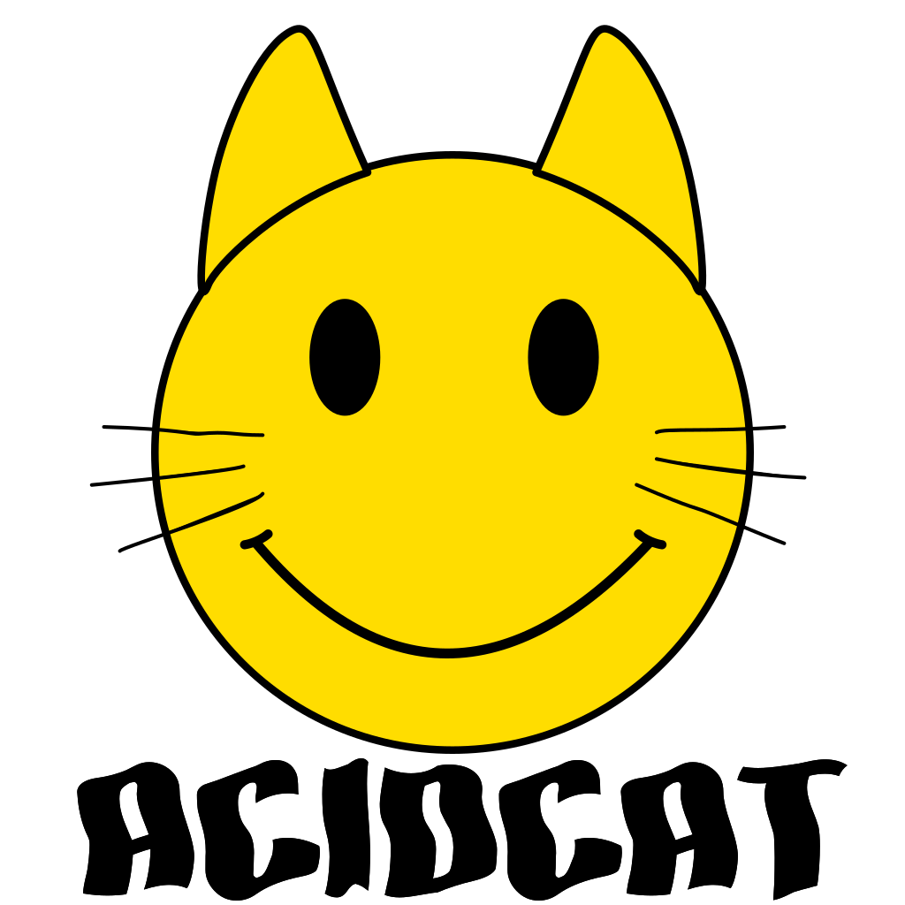

  

# acidcat

A pure-Python inspector, editor, and forensic tool for audio files and synth/DAW
presets: read the metadata, decode the format structure byte by byte, flag
anomalies, repair broken containers, and identify how a file was made.

Reads BPM, key, duration, tags, and format info from WAV, AIFF, MP3, FLAC,
OGG, Opus, M4A, MIDI, and Serum presets. Also structurally decodes Bitwig
(.bwpreset/.bwclip), Native Instruments (Massive/Absynth/Kontakt/NKS/KORE),
Vital, NCW, SoundFont (SF2/SF3), tracker modules (MOD/XM/IT), MP4, VST FXP,
ReCycle RX2, and RMID containers via `inspect`. Beyond reading: `repair` and
`validate` fix and check container structure (stale sizes, offset tables,
counts, pad bytes) without touching a byte of audio, and `audit` gives a
forensic verdict (structure, integrity, hidden data, and the writing tool).
One pure-Python dependency (mutagen); the native `inspect` walkers need nothing.
Optional librosa analysis for BPM/key detection and ML feature extraction.

Also ships per-library SQLite indexes (`acidcat index`) tracked in a
small global registry, plus an MCP server (`acidcat-mcp`) so an LLM can
query your whole collection across libraries by bpm, key, tags, or
full-text.

## Install

    git clone https://github.com/hed0rah/acidcat.git
    cd acidcat
    pip install -e .                # core + mutagen (WAV/AIFF/MIDI/Serum/MP3/FLAC/OGG/Opus/M4A)
    pip install -e .[analysis]      # + librosa BPM/key detection + features
    pip install -e .[mcp]           # + MCP server (acidcat-mcp, stdio)
    pip install -e .[mcp-http]      # + MCP streamable-HTTP transport (acidcat-mcp --transport http)
    pip install -e .[all]           # everything

## Quick Start

    # single file -- instant metadata
    acidcat kick_808.wav
    acidcat loop.mp3
    acidcat pad.flac

    # pipe from stdin
    cat file.wav | acidcat
    curl https://example.com/loop.mp3 | acidcat -

    # JSON output for piping
    acidcat kick_808.wav -f json | jq .BPM

    # deep analysis with librosa
    acidcat kick_808.wav --deep

    # scan a mixed-format directory
    acidcat scan ~/Samples/Breaks -n 200

## Supported Formats

| Format | Extension | What acidcat reads |
|--------|-----------|-------------------|
| WAV    | `.wav`    | BPM, key, loop points, beats, ACID/SMPL, LIST/INFO, bext, cart, iXML |
| AIFF   | `.aif`    | Duration, format, name, author, copyright, markers |
| MP3    | `.mp3`    | BPM, key, title, artist, album, genre, comment (ID3v2) |
| FLAC   | `.flac`   | BPM, key, title, artist, album, genre (Vorbis Comment) |
| OGG    | `.ogg`    | BPM, key, title, artist, album, genre (Vorbis Comment) |
| Opus   | `.opus`   | BPM, key, title, artist (Vorbis Comment) |
| M4A    | `.m4a`    | BPM, key, title, artist, album, genre (iTunes atoms) |
| MIDI   | `.mid`    | BPM, key sig, time sig, tracks, note count/range |
| RMID   | `.rmid`   | RIFF-wrapped MIDI: RIFF wrapper + the inner SMF (inspect) |
| Serum  | `.SerumPreset` | Preset name, author, tags, description |
| VST FXP | `.fxp` | Preset kind, plugin id, version, preset name (inspect) |
| ReCycle | `.rx2` | CAT/REX2 chunks, creator, slice count (inspect) |
| Bitwig WT | `.wt` | Wavetable header: frame count, samples/frame, 16-bit sample block (inspect) |
| Bitwig | `.bwpreset`, `.bwclip` | Device tree, parameters, clip notes (inspect + index) |
| Bitwig multisample | `.multisample` | Zone map: per-sample root note, key/velocity range, loop (inspect) |
| Native Instruments | `.nmsv`, `.nabs`, `.ksd`, `.nksf`, `.nki` | Preset metadata, NKS tags, FastLZ subtree (inspect + index) |
| Vital  | `.vital`  | Patch name, author, tags, modulation matrix (inspect + index) |
| NCW    | `.ncw`    | NI Compressed Wave header, channel/block info (inspect + convert to WAV) |
| SoundFont | `.sf2`, `.sf3` | sfbk metadata + every named sample with its byte offset; SF3 = Ogg-Vorbis samples (inspect + convert to WAV/Ogg) |
| Tracker | `.mod`, `.xm`, `.it` | ProTracker / FastTracker II / Impulse Tracker: header, pattern order, every embedded sample at its byte offset; IT offset tables as pointers (inspect) |
| MP4    | `.mp4`, `.m4a` | Box tree, codec info, iTunes tags, `stco`/`co64` offset tables (inspect + repair) |

## Commands

| Command | Description |
|---------|-------------|
| `acidcat FILE` | Show metadata for a single file (auto-detected) |
| `acidcat DIR` | Batch-scan a directory (auto-detected) |
| `acidcat -` | Read from stdin |
| `acidcat info FILE` | Explicit single-file metadata dump |
| `acidcat scan DIR` | Batch-scan with CSV output |
| `acidcat chunks FILE` | Walk RIFF chunks -- offsets, sizes, parsed fields |
| `acidcat survey DIR` | Count chunk types across a directory tree |
| `acidcat shape DIR` | One-line structural fingerprint per file for specimen-hunting -- pipe to `sort \| uniq -c` to surface rare shapes; `--fast` (header-only), `--anomalies`, `--format FMT`, `--coarse` |
| `acidcat detect FILE\|DIR` | Estimate BPM/key using librosa |
| `acidcat features DIR` | Extract 50+ audio features for ML |
| `acidcat dump FILE CHUNK [...]` | Hex-dump specific RIFF chunks |
| `acidcat od FILE` | Colored objdump-x-style hex view: header bytes plus per-field offset / hex / decoded value, opaque payloads dimmed; `--color`, `--width` |
| `acidcat inspect FILE... [--hex] [--frames] [--only/--exclude IDS] [--full] [--anomalies] [--pretty] [--color]` | Byte-level structural dump (WAV, RF64, AIFF, MIDI, RMID, Serum, VST FXP, ReCycle RX2, Bitwig WT, MP3, FLAC, OGG, MP4/M4A, Bitwig, Vital, NCW, Native Instruments (Massive/Absynth/Kontakt/NKS/KORE)) with lint warnings. Takes multiple files (each under a `File:` banner; JSON becomes NDJSON). `--frames` per-frame/event dump, `--only`/`--exclude` select chunks, `--hex` raw bytes, `--full` a self-contained JSON dump feeding `acidcat explore`, `--anomalies` a forensic scan (trailing data, polyglots, cavities, size mismatches, LSB-stego notice), `--pretty` a human-friendly metadata view, `--verbose` a deep deconstruction (Bitwig device tree/parameters/notes, Vital modulation matrix, ...), `--color` to syntax-highlight |
| `acidcat index DIR` | Upsert DIR into the global SQLite index |
| `acidcat query [flags]` | Filter the global index by bpm/key/tag/text |
| `acidcat query --compatible-with FILE` | Find samples that mix with FILE: harmonic key (Camelot) + compatible tempo (incl. half/double-time) |
| `acidcat convert FILE [-o OUT]` | Export/extract: `.bwclip` -> MIDI, NCW -> WAV (single file or a directory), SF2/SF3 -> a folder of samples |
| `acidcat write FILE --set field=value` | Edit metadata in place, with a `_original` backup, `-o` copy, and `--dry-run`; custom frames via `txxx:NAME=value`; Bitwig/NI preset editing (experimental) |
| `acidcat probe FILE read\|scan\|find\|strings\|hexdump\|diff\|entropy\|map ...` | Low-level byte dissection (RE-tool surface): typed read at an offset (`read fmt.sample_rate -t u32`), value scan, byte-pattern find, strings, hexdump, diff, plus `entropy` (Shannon curve + histogram) and `map` (binvis Hilbert byte-map). Addresses can be raw offsets or structural names (`chunk` / `chunk.field`) resolved through the walker |
| `acidcat carve FILE (--chunk ID \| --trailing \| --offset N [--length N])` | Extract a structurally-identified byte region (a chunk payload, an appended blob, or an explicit range) to a file or stdout |
| `acidcat repair FILE [--dry-run] [-o OUT]` | Fix stale container sizes, offset tables, table counts, and pad bytes without touching a byte of audio (WAV, RF64, AIFF, MP4, FLAC); keeps a `_original` backup |
| `acidcat validate FILE\|DIR [-q]` | Read-only structural check with an exit code (0 = all consistent, 1 = any violation); walks a directory tree |
| `acidcat audit FILE [--json]` | Forensic verdict in four parts: STRUCTURE (repairable inconsistencies), INTEGRITY (fake hi-res, duration mismatch), HIDDEN (concealed/appended data + a carve command), PROVENANCE (the writing tool) |
| `acidcat tui FILE` | Interactive terminal inspector: goto/search, follow pointers (`x`), byte map (`m`), edit fields, and validate/repair (`v`/`r`) |
| `acidcat cover FILE [-o art.jpg] [--set img] [--remove]` | Extract, embed, or remove embedded cover art (MP3/FLAC/MP4/Ogg) |
| `acidcat explore FILE [-o out.html]` | Build a standalone interactive HTML byte-explorer (hex grid + tinted fields + LSB heat-map) |

## Global Flags

    -f, --format FMT                Output format (default varies by command)
    -o, --output FILE               Write output to file
    -q, --quiet                     Suppress progress output
    -v, --verbose                   Extra detail
    -n, --num N                     Max files to scan (default: 500)
    --has CHUNKS                    Filter by chunk IDs (comma-separated)
    --deep                          Include librosa analysis

Most commands accept `table`, `json`, and `csv` (default `table`, but
`scan` and `features` default to `csv`). Two differ: `inspect` is
`table`/`json`, and `dump` is `hex`/`json`.

## Dependency Groups

| Group | What it adds | Commands enabled |
|-------|-------------|-----------------|
| (none) | mutagen (base) | info, scan, chunks, survey, dump, inspect, explore, index, query, write, convert, cover for WAV/AIFF/MIDI/Serum/MP3/FLAC/OGG/Opus/M4A + all inspect-only formats |
| `[analysis]` | librosa, numpy, scipy, soundfile | detect, features, info --deep |
| `[mcp]` | mcp SDK | `acidcat-mcp` stdio server |
| `[mcp-http]` | starlette + uvicorn | `acidcat-mcp --transport http` (streamable-HTTP transport) |
| `[all]` | everything (includes `[mcp-http]`) | all commands, all formats |

## Examples

### Metadata Exploration

    # what chunks exist in your sample library?
    acidcat survey ~/Samples/Loops -n 5000

    # walk all chunks in a specific file
    acidcat chunks ~/Samples/Loops/breakbeat.wav

    # hex-dump the ACID and SMPL chunks
    acidcat dump ~/Samples/Loops/breakbeat.wav acid smpl

    # fingerprint a whole tree, then rank the rarest structural shapes
    acidcat shape ~/Samples --no-path | sort | uniq -c | sort -n

    # colored objdump-x-style hex view of a file's headers and fields
    acidcat od ~/Samples/Loops/breakbeat.wav

    # scan only files with ACID metadata
    acidcat scan ~/Samples/Loops --has acid -n 200

    # scan a directory with mixed formats (WAV, MP3, FLAC, etc.)
    acidcat scan ~/Samples -n 500

### BPM / Key Detection

    # estimate BPM/key with librosa (for files without metadata)
    acidcat detect ~/Samples/OneShots

    # scan with librosa fallback for missing metadata
    acidcat scan ~/Samples/Loops --fallback -n 100

### ML Feature Extraction

    # extract 50+ audio features to CSV
    acidcat features ~/Samples/Loops -n 500

Similarity search runs on the index (`acidcat index --features`, then the
MCP `find_similar` tool), not on these one-off CSVs.

## Libraries (per-directory indexes)

`acidcat scan` writes a one-off CSV. `acidcat index` is the persistent
path: each directory you index becomes a *library* with its own SQLite
file, and a small global registry at `~/.acidcat/registry.db` lets reads
fan out across every library you have registered.

By default the per-library DB lives centrally at
`~/.acidcat/libraries/<label>_<hash>.db`. Pass `--in-tree` if you'd
rather have the DB travel with the data at
`<library>/.acidcat/index.db`.

    # register and index a library (label defaults to basename of DIR)
    acidcat index ~/Samples/Loops --label loops
    acidcat index ~/Samples/OneShots --label oneshots

    # show every registered library
    acidcat index --list

    # per-library stats
    acidcat index --stats loops

    # extract librosa features during indexing (slower, enables similarity)
    acidcat index ~/Samples/Loops --label loops --features

    # rebuild a library's DB from scratch
    acidcat index ~/Samples/Loops --label loops --rebuild

    # forget a library (registry only) vs remove it (deletes the DB file)
    acidcat index --forget loops
    acidcat index --remove loops

    # list registered libraries whose DB file is missing on disk
    acidcat index --orphans

    # import a legacy <name>_tags.json into a library
    acidcat index ~/Samples --label samples --import-tags old_tags.json

Nested libraries are rejected at registration time: if you've registered
`~/Samples`, you can't also register `~/Samples/Loops` until you forget
the parent.

### Discovery

For users with many scattered packs, `--discover` walks a tree and
registers every qualifying subdirectory as its own library in one pass.

    # preview what would get registered (no writes)
    acidcat index --discover ~/Samples --dry-run

    # actually register them
    acidcat index --discover ~/Samples

    # tighter threshold and namespacing for a subset of your collection
    acidcat index --discover /mnt/external/old_drives \
                  --min-samples 50 --label-prefix "ext_"

A directory qualifies if its subtree (within `--max-depth`, default 3)
contains at least `--min-samples` audio files (default 20). Non-
qualifying parents are recursed into so packs nested inside catch-all
folders still surface. Already-registered roots are skipped. The home
directory is refused as a discover root to prevent runaway registration.

### Querying

By default `acidcat query` fans out across every registered library and
merges the results.

    acidcat query --bpm 120:130 --key Am
    acidcat query --tag drums --tag punchy --duration :1
    acidcat query --text "dusty lofi" --limit 20
    acidcat query --format mp3 --root loops
    acidcat query --root loops,oneshots --bpm 128
    acidcat query --bpm 128 --paths-only | xargs -I {} cp {} out/

`--root` accepts a label, an absolute path, or a comma-separated list.
Override the registry on any command with `--registry PATH` or the
`ACIDCAT_REGISTRY` environment variable.

## MCP Server

`acidcat-mcp` is a stdio MCP server that exposes the registered libraries
as structured tools. An LLM can ask "what libraries do I have?",
search across them by metadata, find compatible keys via Camelot, or
(with `[analysis]` installed) find similar samples by librosa feature
cosine.

    pip install -e .[mcp]            # minimum for discovery + writes
    pip install -e .[analysis,mcp]   # unlock find_similar / analyze_*

Claude Desktop / Claude Code config:

    {
      "mcpServers": {
        "acidcat": {
          "command": "acidcat-mcp"
        }
      }
    }

Optional: pass `--registry PATH` on the server process or set
`ACIDCAT_REGISTRY` if your registry lives outside the default location.

Tool tiers (each tool description starts with `Fast.`, `SLOW.`, or
`VERY SLOW.` so the model self-selects):

- **Fast (SQLite only)**: `search_samples`, `get_sample`, `locate_sample`,
  `list_libraries`, `list_tags`, `list_keys`, `list_formats`,
  `index_stats`, `find_compatible`
- **Slow analysis** (needs `[analysis]`): `find_similar`, `analyze_sample`,
  `detect_bpm_key`
- **Index management**: `reindex`, `reindex_features`,
  `discover_libraries`
- **Write** (marked destructive): `register_library`, `forget_library`,
  `tag_sample`, `set_sample_description`

## License

MIT
